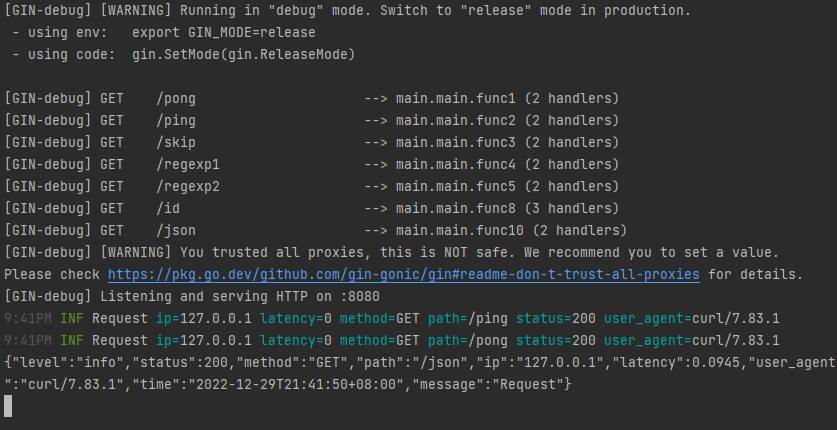

# logger

[](https://github.com/gin-contrib/logger/actions/workflows/go.yml)
[](https://codecov.io/gh/gin-contrib/logger)
[](https://goreportcard.com/report/github.com/gin-contrib/logger)
[](https://godoc.org/github.com/gin-contrib/logger)
[](https://gitter.im/gin-gonic/gin)

Gin middleware/handler to log URL paths using [rs/zerolog](https://github.com/rs/zerolog).

## Example

```go
package main

import (
  "fmt"
  "net/http"
  "regexp"
  "time"

  "github.com/gin-contrib/logger"
  "github.com/gin-contrib/requestid"
  "github.com/gin-gonic/gin"
  "github.com/rs/zerolog"
  "github.com/rs/zerolog/log"
)

var rxURL = regexp.MustCompile(`^/regexp\d*`)

func main() {
  r := gin.New()

  // Add a logger middleware, which:
  //   - Logs all requests, like a combined access and error log.
  //   - Logs to stdout.
  // r.Use(logger.SetLogger())

  // Example pong request.
  r.GET("/pong", logger.SetLogger(), func(c *gin.Context) {
    c.String(http.StatusOK, "pong "+fmt.Sprint(time.Now().Unix()))
  })

  // Example ping request.
  r.GET("/ping", logger.SetLogger(
    logger.WithSkipPath([]string{"/skip"}),
    logger.WithUTC(true),
    logger.WithSkipPathRegexps(rxURL),
  ), func(c *gin.Context) {
    c.String(http.StatusOK, "pong "+fmt.Sprint(time.Now().Unix()))
  })

  // Example skip path request.
  r.GET("/skip", logger.SetLogger(
    logger.WithSkipPath([]string{"/skip"}),
  ), func(c *gin.Context) {
    c.String(http.StatusOK, "pong "+fmt.Sprint(time.Now().Unix()))
  })

  // Example skip path request.
  r.GET("/regexp1", logger.SetLogger(
    logger.WithSkipPathRegexps(rxURL),
  ), func(c *gin.Context) {
    c.String(http.StatusOK, "pong "+fmt.Sprint(time.Now().Unix()))
  })

  // Example skip path request.
  r.GET("/regexp2", logger.SetLogger(
    logger.WithSkipPathRegexps(rxURL),
  ), func(c *gin.Context) {
    c.String(http.StatusOK, "pong "+fmt.Sprint(time.Now().Unix()))
  })

  // add custom fields.
  r.GET("/id", requestid.New(requestid.WithGenerator(func() string {
    return "foobar"
  })), logger.SetLogger(
    logger.WithLogger(func(c *gin.Context, l zerolog.Logger) zerolog.Logger {
      if trace.SpanFromContext(c.Request.Context()).SpanContext().IsValid() {
        l = l.With().
          Str("trace_id", trace.SpanFromContext(c.Request.Context()).SpanContext().TraceID().String()).
          Str("span_id", trace.SpanFromContext(c.Request.Context()).SpanContext().SpanID().String()).
          Logger()
      }

      return l.With().
        Str("id", requestid.Get(c)).
        Str("foo", "bar").
        Str("path", c.Request.URL.Path).
        Logger()
    }),
  ), func(c *gin.Context) {
    c.String(http.StatusOK, "pong "+fmt.Sprint(time.Now().Unix()))
  })

  // Example of JSON format log
  r.GET("/json", logger.SetLogger(
    logger.WithLogger(func(_ *gin.Context, l zerolog.Logger) zerolog.Logger {
      return l.Output(gin.DefaultWriter).With().Logger()
    }),
  ), func(c *gin.Context) {
    c.String(http.StatusOK, "pong "+fmt.Sprint(time.Now().Unix()))
  })

  // Example of logging data on gin.Context
  r.GET("/context", logger.SetLogger(
    logger.WithContext(func(c *gin.Context, e *zerolog.Event) *zerolog.Event {
      return e.Any("data1", c.MustGet("data1")).Any("data2", c.MustGet("data2"))
    }),
  ), func(c *gin.Context) {
    c.Set("data1", rand.Intn(100))
    c.Set("data2", rand.Intn(100))
    c.String(http.StatusOK, "pong "+fmt.Sprint(time.Now().Unix()))
  })

  // Example of skipper usage
  r.GET("/health", logger.SetLogger(
    logger.WithSkipper(func(c *gin.Context) bool {
      return c.Request.URL.Path == "/health"
    }),
  ), func(c *gin.Context) {
    c.String(http.StatusOK, "pong "+fmt.Sprint(time.Now().Unix()))
  })

  // Example of skipper usage
  v1 := r.Group("/v1", logger.SetLogger(
    logger.WithSkipper(func(c *gin.Context) bool {
      return c.Request.Method == "GET"
    })))
  {
    v1.GET("/ping", func(c *gin.Context) {
      c.String(http.StatusOK, "pong01 "+fmt.Sprint(time.Now().Unix()))
    })
    v1.POST("/ping", func(c *gin.Context) {
      c.String(http.StatusOK, "pong02 "+fmt.Sprint(time.Now().Unix()))
    })
  }

  // Listen and Server in 0.0.0.0:8080
  if err := r.Run(":8080"); err != nil {
    log.Fatal().Msg("can' start server with 8080 port")
  }
}
```

## Screenshot

Run app server:

```sh
go run _example/main.go
```

Test request:

```sh
curl http://localhost:8080/ping
curl http://localhost:8080/pong
curl http://localhost:8080/json
```


