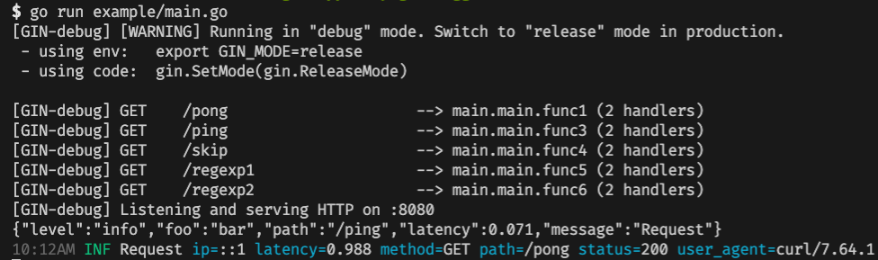

# logger

[](https://github.com/gin-contrib/logger/actions/workflows/go.yml)
[](https://codecov.io/gh/gin-contrib/logger)
[](https://goreportcard.com/report/github.com/gin-contrib/logger)
[](https://godoc.org/github.com/gin-contrib/logger)
[](https://gitter.im/gin-gonic/gin)

Gin middleware/handler to logger url path using [rs/zerolog](https://github.com/rs/zerolog).

## Example

```go
package main

import (
	"fmt"
	"io"
	"net/http"
	"os"
	"regexp"
	"time"

	"github.com/gin-contrib/logger"
	"github.com/gin-gonic/gin"
	"github.com/rs/zerolog"
	"github.com/rs/zerolog/log"
)

var rxURL = regexp.MustCompile(`^/regexp\d*`)

func main() {
	zerolog.SetGlobalLevel(zerolog.InfoLevel)
	if gin.IsDebugging() {
		zerolog.SetGlobalLevel(zerolog.DebugLevel)
	}

	log.Logger = log.Output(
		zerolog.ConsoleWriter{
			Out:     os.Stderr,
			NoColor: false,
		},
	)

	r := gin.New()

	// Add a logger middleware, which:
	//   - Logs all requests, like a combined access and error log.
	//   - Logs to stdout.
	// r.Use(logger.SetLogger())

	// Example pong request.
	r.GET("/pong", logger.SetLogger(), func(c *gin.Context) {
		c.String(http.StatusOK, "pong "+fmt.Sprint(time.Now().Unix()))
	})

	// Example ping request.
	r.GET("/ping", logger.SetLogger(
		logger.WithSkipPath([]string{"/skip"}),
		logger.WithUTC(true),
		logger.WithSkipPathRegexp(rxURL),
		logger.WithLogger(func(c *gin.Context, out io.Writer, latency time.Duration) zerolog.Logger {
			return zerolog.New(out).With().
				Str("foo", "bar").
				Str("path", c.Request.URL.Path).
				Dur("latency", latency).
				Logger()
		}),
	), func(c *gin.Context) {
		c.String(http.StatusOK, "pong "+fmt.Sprint(time.Now().Unix()))
	})

	// Example skip path request.
	r.GET("/skip", logger.SetLogger(
		logger.WithSkipPath([]string{"/skip"}),
	), func(c *gin.Context) {
		c.String(http.StatusOK, "pong "+fmt.Sprint(time.Now().Unix()))
	})

	// Example skip path request.
	r.GET("/regexp1", logger.SetLogger(
		logger.WithSkipPathRegexp(rxURL),
	), func(c *gin.Context) {
		c.String(http.StatusOK, "pong "+fmt.Sprint(time.Now().Unix()))
	})

	// Example skip path request.
	r.GET("/regexp2", logger.SetLogger(
		logger.WithSkipPathRegexp(rxURL),
	), func(c *gin.Context) {
		c.String(http.StatusOK, "pong "+fmt.Sprint(time.Now().Unix()))
	})

	// Listen and Server in 0.0.0.0:8080
	if err := r.Run(":8080"); err != nil {
		log.Fatal().Msg("can' start server with 8080 port")
	}
}
```

## Screenshot

Run app server:

```sh
go run example/main.go
```

Test request:

```sh
curl http://localhost:8080/ping
curl http://localhost:8080/pong
```


